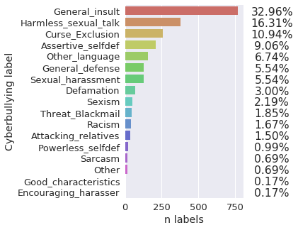
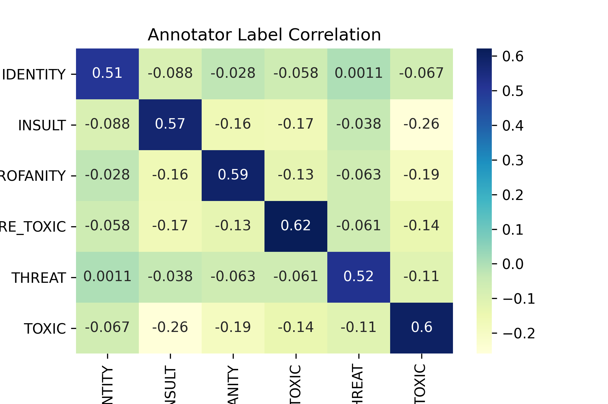
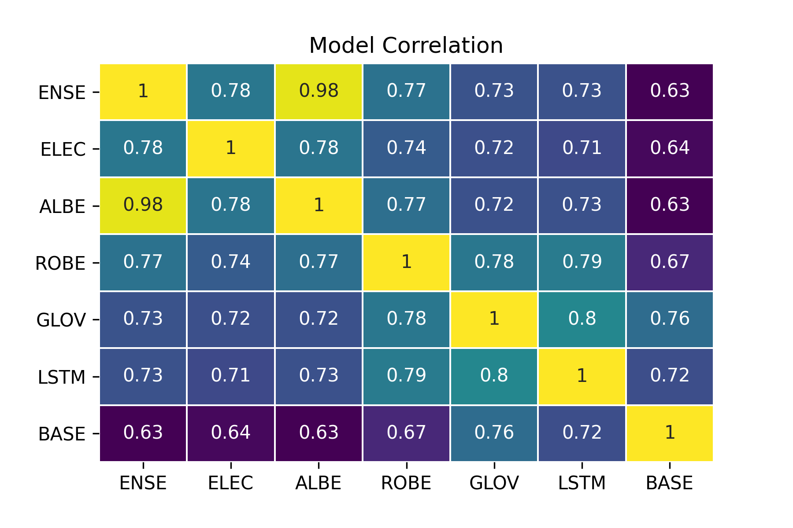
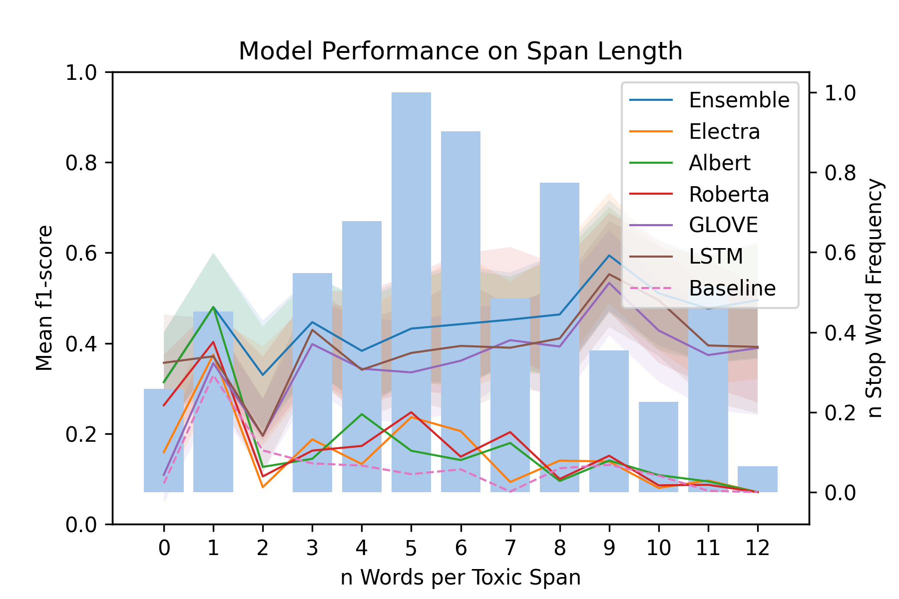
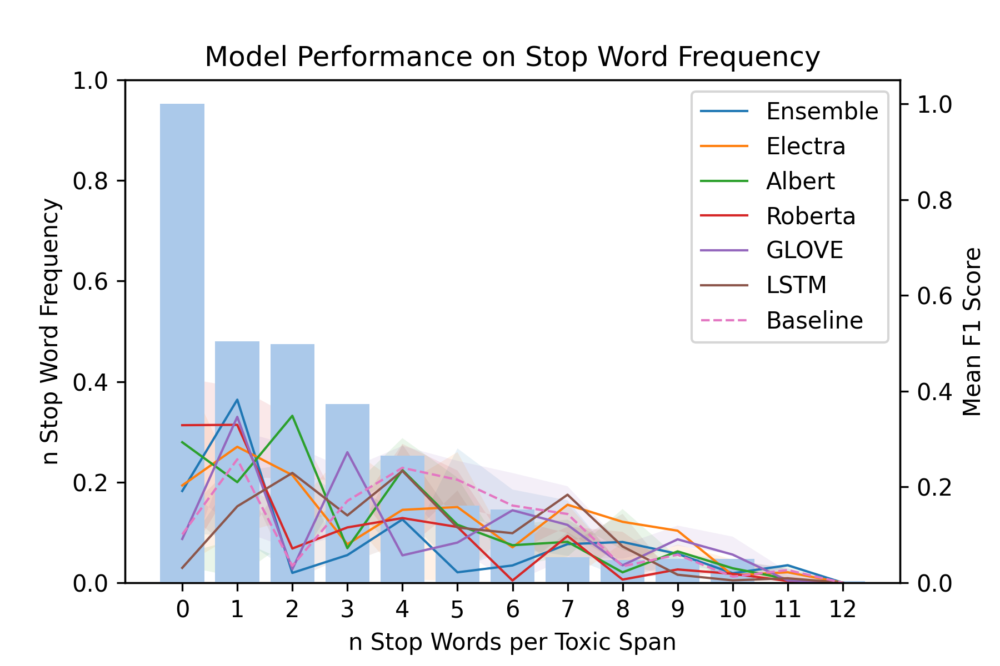
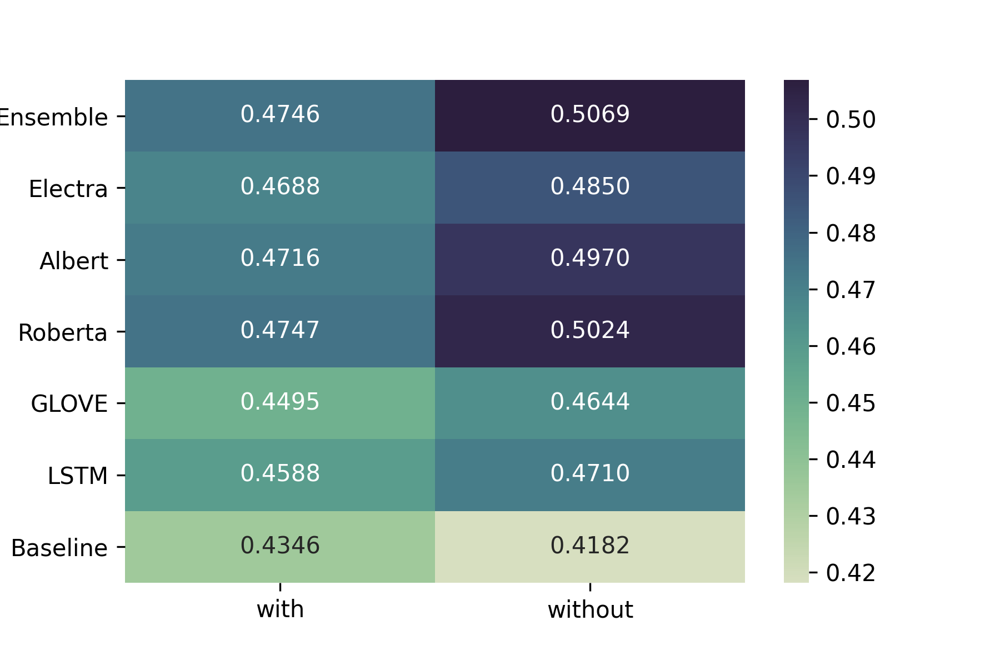
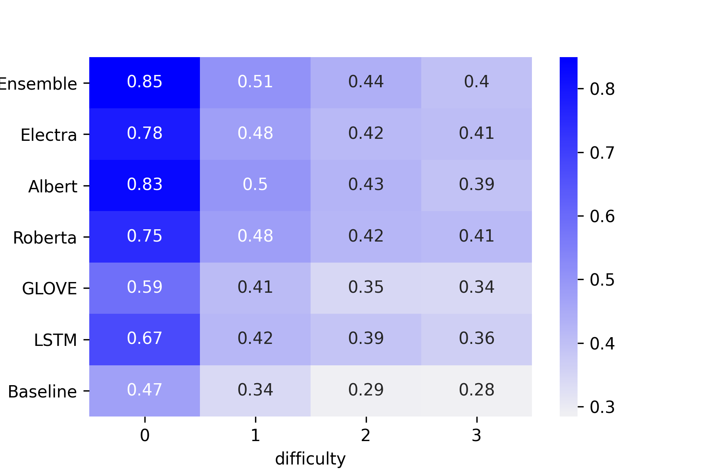
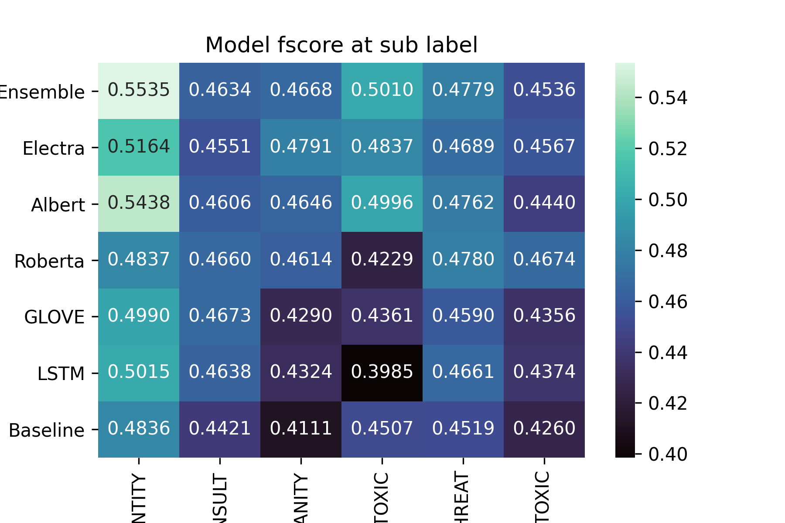

# Toxic Spans Detection in Dutch

Toxic span detection is a development of binary toxicity detection which has garnered recent attention, in the form of shared tasks and datasets [@wulczynExMachinaPersonal2017; @zampieriSemEval2019TaskIdentifying2019]. Span detection asks systems to detect which specific series of words are toxic, irrespective of the text's overall toxicity. We introduce an ensemble-based approach to toxic span detection for Dutch messages, building on the work of teams at the recent SemEval 2021 Task 5 [@johnpavlopoulosSemEval2021Task2021]. We combine two task interpretations and five transformers models in one ensemble approach to achieve a character offset f1-score of **.7112** on Dutch messages. We also present a new dataset of annotated for span toxicity using messages from the AMiCA project on children's cyberbullying in Dutch [@vanHee_2018].

Span level classification offers greater precision than document level, and in an application setting, facilitates effective downstream protocols. Systems are able to deal with toxicity on a word-by-word level, rather than at a document level that may contain spans of multiple topic. In turn, systems can act more precisely and with greater relevance to the toxicity of each word.

#### Task Interpretation

Multiple teams at SemEval task 5 recognised the need for a multi-faceted task interpretation that targeted both longer and shorter spans. illustrates this phenomena using data from the task itself [@johnpavlopoulosSemEval2021Task2021].

We interpret the task in two ways: Firstly, through a [span-based](#span-based-prediction) approach where the source features are a message's word-token representations and the target is a binary value for each word, illustrated in . Secondly, a [word-based](#word-based-prediction) approach where the target is a single word's binary toxicity value and the source features are the words before and after that word, illustrated in . We then combine these predictions and use a Bidirectional LSTM to predict a final toxicity score for each word, based on the predictions of the component models.

Combinations of word-based and span-based task interpretations were attempted by teams at Semeval Task 5 with varying degrees of success. By addressing potential annotation issues raised by authors, we improve model transferability, and in turn accuracy. outlines our analysis of model performance in relation to correlation, and its effect on Ensemble accuracy. In the we discuss the process of using prediction correlation for ensemble model design.

#### Annotation Rationales {#anno-rat}

Multiple teams described significantly lower f1 score's on test data during the shared task. Burtenshaw and Kestemont proposed that this could be related to underlying annotation rationales that were present or absent in testing. They proposed that one rationale selected only the most toxic words and another selected longer sequences, including stop-words and less toxic words. illustrates this phenomena by showing the annotated spans as orange text, and two potential rationales as blue and green underline. We mitigate this through detailed annotator instructions and a range of annotation tools for multiple rationales, described in .Motivation 

This study falls within an overarching project to develop language classification tools for paediatric wards in Dutch-speaking Belgium. We are developing models and datasets targeted at improving safety within conversational systems used in paediatric wards. Therefore, the data we have developed is annotated by paediatric medics as part of a larger annotation study. Furthermore, our analysis targets performance and effectiveness in Dutch. Our goal is to transfer the same success teams at SemEval Task 5 showed on English data to Dutch data, and to compare performance across languages. We have two **hypotheses**: Firstly, that the multilingual base of component transformer models, combined with the linguistic similarity of the two languages, will lead to comparable performance in Dutch as English. Secondly, that clarifying annotation rationale with annotators, and in turn improving data distribution, will lead to an effective ensemble of word and span based task interpretations.

# Data Collection

## AMiCA Data

Van Hee et al. developed the AMiCA dataset through multiple methods; anonymous donation, simulation and parsing from the web. These channels come with various ethical restrictions, which Emmery et al. outline [@emmeryCurrentLimitationsCyberbullying2019]. We have limited this study to the simulated portion of the dataset, where Broeck et al. used a crowd-sourcing role play method to simulate instances of bullying [@broeck2014online]. 200 Participants ranging from age 14 to 18 were asked to study and behave as predefined bullying characters, within a social media chat environment [^1]. Each character was developed by researchers and based on archetypal bullying roles supported by literature. Table give the macro details of the data used.

{#fig:amica-labels width="\\columnwidth"}

## Manual Annotation {#manual-anno}

Manual Annotation was performed on the AMiCA dataset of children's conversations in Dutch. As well as direct text annotation, we also used qualitative surveys to validate the annotation and reveal potential annotation rationals or shortcomings in task definition. Addressing the observations of researchers at SemEval 2021 Task 5 [@benburtenshawUAntwerpSemEval2021Task2021; @johnpavlopoulosSemEval2021Task2021] Annotators performed four simultaneous tasks: toxic span identification, multi-label span identification, document toxicity, and document multi-label toxicity. Within this study we focus solely on span identification, though we outline [Multi-label Toxicity](#related-multilabel) above and draw on multi-label annotations for error analysis in . The annotation process was implemented through a web interface and initiated via open call, employment, and a formal introduction. Due to the overarching [motivation](#motivation) of this project, we worked with paediatric medics. We principally targeted a uniform annotation rationale and gave annotators detailed examples of proper annotation to discuss and refer to.

#### Task Setup

The annotation process was performed by a group of 7 annotators that were formally inducted into the process, and given technical, practical, and psychological advice. For examples; they were shown how the technical interface worked, the difference between labels, and how they would be paid for their work. Furthermore, they were advised on the potentially toxic nature of the material they would read, and informed that they were free to stop at any point without ramification. All of the information was also compiled within an instructions sheet, that was embedded within the annotation environment. The web interface allowed annotators to flag possible rationales and challenging samples. Researchers then gave advice to annotators based on this feedback.

#### Annotator Feedback

Following the annotation task, annotators were asked to complete a qualitative survey within which four open-ended validation questions were asked. For example, 'How did you deal with queries relating to the task ? '. A valid answer referenced the introduction or instructions, whilst a invalid answer would reference an unavailable or irrelevant source of information. We intended to clarify and validate that they had completely understood the task, and that they were aware of the appropriate channels for advice. All annotators referenced the instructions, introduction, or contacting a researcher in their reply.

#### Interannotator Agreement {#calculate-inter-annotator-agreement}

was calculated through two discrete annotators where the largest set of overlapping instances by the same two annotators was used to calculate a **Cohen Kappa score of 0.616**. This shows that there was substantial agreement between annotators. We can compare this to a seminal toxicity annotation project, like that of Wulczyn et al, that scored 0.45 [@wulczynExMachinaPersonal2017]. We can also delve further into inter-annotator relations through multi-label use. reveals the Cohen Kappa between labels. We see that all six true label pairs (i.e. TOXIC & TOXIC) achieve a fair to substantial correlation, and that all false label pairs (i.e. INSULT & THREAT) do not correlate. This is evidence of valid agreement between annotators and a comparable understanding of toxicity.

{#fig:anno-corr width="\\columnwidth"}

#### Compare Toxicity and Cyberbullying {#compare-toxicity-and-cyber-bullying}

As a precursor to the main experiments, and to align this annotation process with Van Hee et al. and Emmery et al., we tested how cyberbullying spans act as a naive predictor of toxic spans using the combined labels for each class and F1 Score [@vanheeDetectionFinegrainedClassification2015; @emmeryCurrentLimitationsCyberbullying2019]. This process received an F1 score of 0.5278, showing that toxicity and cyberbullying may be partially aligned. Emmery and colleagues discuss the relationship between toxicity and cyberbullying on a detailed and semantic level.

# System Overview

#### Task Interpretations

We used two types of component model based on two task interpretations; [span-based prediction](#span-based-prediction) and [word-based prediction](#word-based-prediction). We used two word-based models \[GLOV, BERT\] and three span-based models \[ALBE, ROBE, ELEC\], the softmax output of all models were concatenated and supplied to an LSTM model \[ENSE\] [@hochreiter1997long].

#### Motivation

We intended for the [word-based models](#word-based-prediction) to learn local features in the tokens nearest the target word, and for the [span-based](#span-based-prediction) to learn the overall features that affected sub and multi word toxicity.

## Baselines

#### Lexical Lookup {#Lexical}

Using a subset of samples from the development data, we created a toxic words list from all words within toxic spans, except for stop words. On a test portion of data, we then classified words as toxic if they appeared within the aforementioned toxic words list. This approach achieved an **F1-score of 0.3901**. As noted by Burtenshaw and Kestemont, the definition of the toxic words list significantly impacts the accuracy of the approach; depending on which $n$ samples are used, tokenisation method, and word definition [^2]. We compare the behaviour of this baseline on the AMiCA data and Semeval Toxic Span data in .

#### SVM

Using Term Frequency Inverse Document Frequency, we created two document vector representations of toxic and non-toxic spans. Using a Support Vector Machine, we predicted the probability that a word vector appeared within a toxic or non-toxic document [@salton1986introduction; @wuProbabilityEstimatesMulticlass]. We then used a binary threshold of 0.5 and class weights based on relative label frequency to predict whether a word was toxic. This approach achieved an **F1-score of 0.6664** on the test data.

## Model Architecture

{#fig:method-overview width="\\columnwidth"}

### Span-based Prediction

Span-based prediction models used the complete sequence of word-token features, up to a maximum length, to predict toxic character offsets. Sequences were represented as token reference indexes, described in . The target sequence was represented as categorical arrays for toxic, non-toxic, and padding tokens. illustrates this approach.

#### Transformer Models {#albert}

[\[Electra\]]{#Electra label="Electra"}[\[Roberta\]]{#Roberta label="Roberta"} We selected three pretrained transformer models (ALBERT, ROBERTA, ELECTRA) and fine-tuned them for this task with extra linear layers. We performed separate hyper-parameter optimisation for each model, detailed in . ALBERT is a lightweight implementation of a BERT model [@lanALBERTLiteBERT2020; @devlin-etal-2019-bert] that uses feature reduction to reduce training time. ELECTRA is a further development of the BERT model that pre-trains as a discriminator rather than a generator [@clarkELECTRAPRETRAININGTEXT2020]. ROBERTA develops the BERT model approach for robustness, [@liuRoBERTaRobustlyOptimized2019]. During development we found that these three transformer models achieved the highest f1-scores in relation to model correlation compared to alternatives. All models used the Adam optimizer [@kingmaAdamMethodStochastic2017].

### Word-based Prediction

The word-based models treated the task as word toxicity prediction based on a sequence of words before and after the target word. illustrates this approach. The target word toxicity was represented as a binary value. The sequence length before and after the target word was optimised for each model, and described in .

#### Siamese-LSTM with Glove Word Embeddings {#LSTM-Glove}

A Siamese LSTM model used two networks based on separate glove embeddings of the sequence of words before and after the target words [@baoAttentiveSiameseLSTM2018; @baziotisDataStoriesSemEval2017Task2017].

#### LSTM Finetuning Bert-base {#Bert-base}

An LSTM model was trained based on the output of a BERT-base model. The words before and after the target word were used as model features [@devlin-etal-2019-bert].

## Ensemble Model {#Ensemble-Model}

A Bidirectional LSTM model was used to predict token toxicity based word-token features and component model predictions. The model used transformer-style feature representations to predict a sequence of categorical representations for token toxicity, as described in . The ensemble model relied on five fold cross validation, as described in .

# Results

The best performing Ensemble model achieved f1 score of **0.7112**. Ensemble scores are also shown as macro averages of both labels `TOX` and `NOT`.

# Analysis

## Model Correlation {#model-corr}

Ensemble approaches draw on the predictions of component models. An optimum ensemble will ignore the false prediction of one model and rely on the true prediction of another. In theory, this creates a robust and generalised implementation that out-performs any one component model. However, much of the ensemble model's potential lies in the diversity of component models' predictions. Model correlation is a straightforward way of revealing diversity in component model predictions.

{#fig:corr width="\\columnwidth"}

reveals that the ensemble and ALBERT models have a high correlation, a logical outcome of their shared base layers; whilst word-based models \[BERT, GLOV\] have a low correlation, reflecting their diverse task interpretations.

##  Error Analysis 

####  Length of Spans 

reveals that the length of toxic spans had a positive impact on the span-based models' performance. This stands in contrast to Burtenshaw and Kestemont's use of a word-based approach, that was not more accurate on shorter spans during the shared task. In turn, the ensemble model replicated the span-based models' results at longer spans, and the word-based at shorter spans.

{#fig:len width="\\columnwidth"}

####  Stop word Frequency 

The frequency of stop words in toxic spans affected model performance. reveals that, where present, spans with more stop words caused lower model accuracy.

{#fig:stop width="\\columnwidth"}

####  English Loan Word 

use is common within the Dutch language, especially within slang and profanity where loan word use is a mainstay. Using Miller and colleagues loan word detection system, we split data into two subsets, one with and one without loan words [@10.1371/journal.pone.0242709]. We excluded samples with *possible* loan words. reveals a clear performance increase on all models except the baseline. This is most likely caused by the base Transformer models' English language proficiency.

{#fig:loan width="\\columnwidth"}

####  Annotator Label Difficulty 

was collected during annotation by allowing annotators to specify how challenging an annotation was on a scale of 0 to 3. 0 being obvious and 3 being complex or difficult. reveals the models' scores in relation to these annotations. Interestingly we can see that all models replicate this scale through their performance.

{#fig:diff width="\\columnwidth"}

####  Sub classes of Toxicity 

were also collected during annotation but was not used in model training. We can use these labels to analyse the performance of models on labels of each sub class. reveals the f1-score of each model on each sub label.

{#fig:multi width="\\columnwidth"}
